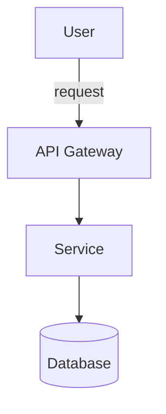

# GitHub README Skill

Generates structured, professional GitHub READMEs tailored to the project type.

---

## Workflow

### 1. Gather project information

Before writing, identify or ask for:

- **Name and brief description** of the project
- **Project type**: library, REST API, CLI, web app, ML/AI, script, plugin, etc.
- **Main language / tech stack**
- **Audience**: end users, developers, both
- **Status**: WIP, beta, stable, maintained, archived
- **Does it have installation/setup steps?** (npm, pip, brew, Docker, etc.)
- **Does it have a demo, screenshots, or video?**
- **License**

If the user already pasted code or described the project, **extract information from context** before asking.

---

### 2. Base structure by project type

Adapt sections to the project type. Always use this hierarchy as a starting point:

```
# Project Name
[Relevant badges]
[1-3 line description]
[Demo / Screenshot if applicable]

## ✨ Features (or Why this project)
## 🚀 Quick Start / Getting Started
## 📦 Installation
## 🔧 Usage / Examples
## ⚙️ Configuration (if applicable)
## 📖 API Reference (if library/API)
## 🤝 Contributing
## 📄 License
```

Optional sections that add value:
- `## 🏗️ Architecture` — for complex projects
- `## 🧪 Testing` — if it has a test suite
- `## 🚢 Deployment` — for apps
- `## 📊 Benchmarks` — for performance-critical libraries
- `## 🗺️ Roadmap` — if actively in development
- `## 🙏 Acknowledgements` — credits

---

### 3. Writing and style rules

#### Tone and clarity
- **First section**: explain WHAT the project does in at most 2 sentences. No fluff.
- Use active voice: "Install dependencies with..." not "Dependencies can be installed by..."
- Be concrete: show real code, not pseudocode
- The README should stand on its own without reading the source code

#### Markdown format for GitHub
```markdown
# H1 — Only for the project title (just one)
## H2 — Main sections
### H3 — Subsections

**bold** for important terms, key file names
`inline code` for commands, variables, function names
> [!NOTE] for important notes (GitHub Flavored Markdown)
> [!WARNING] for warnings
> [!TIP] for tips
```

#### Code blocks: always specify the language
```markdown
    ```bash
    npm install my-project
    ```

    ```python
    from mylib import MyClass
    obj = MyClass(param="value")
    ```
```

---

### 4. Badges

Place badges right below the title, on one line or grouped thematically.

**Most useful badges by category:**

```markdown
<!-- Project status -->


<!-- CI/CD -->


<!-- Package managers -->


<!-- Language -->


```

**Rule**: maximum 6–8 badges. More than that is visual noise.

---

### 5. Table of contents

Use a table of contents ONLY if the README has more than 5 H2 sections. Format:

```markdown
## 📋 Table of Contents

- [Features](#-features)
- [Installation](#-installation)
- [Usage](#-usage)
- [API Reference](#-api-reference)
- [Contributing](#-contributing)
- [License](#-license)
```

GitHub auto-generates anchors: lowercase, spaces → hyphens, emojis are stripped from anchors.

---

### 6. Critical sections — how to write them well

#### Installation

Provide concrete commands for EACH available installation method:

```markdown
## 📦 Installation

**npm**
```bash
npm install my-package
```

**yarn**
```bash
yarn add my-package
```

**From source**
```bash
git clone https://github.com/user/repo.git
cd repo
npm install
```
```

#### Usage / Examples

This is the most important section. It must include:
1. The simplest possible example (Hello World)
2. A realistic / practical example
3. For CLIs: a table of commands/flags
4. For libraries: examples of the most commonly used functions

```markdown
## 🔧 Usage

### Basic example
```python
from mylib import Client

client = Client(api_key="your-key")
result = client.process("hello world")
print(result)  # → {"status": "ok", "data": ...}
```

### Advanced usage
[more complex example]
```

#### Contributing

Always include, even if brief:

```markdown
## 🤝 Contributing

Contributions are welcome! Please:

1. Fork the repository
2. Create a branch: `git checkout -b feature/my-feature`
3. Commit your changes: `git commit -m 'feat: add my feature'`
4. Push to the branch: `git push origin feature/my-feature`
5. Open a Pull Request

Please read [CONTRIBUTING.md](CONTRIBUTING.md) for details on the process.
```

---

### 7. Templates by project type

#### CLI Tool
Prioritize: global installation, command table, terminal usage examples.
Include `--help` output or a screenshot of the CLI in action.

#### Library / SDK
Prioritize: API Reference, code examples, version compatibility.
Include a table of main methods with their signature and description.

#### REST API / Backend
Prioritize: available endpoints, authentication, examples with curl/fetch.
Include an endpoint table: method, path, description, auth required.

#### Web App / Frontend
Prioritize: demo screenshot/GIF, tech stack, environment variables.
Include local development and deployment instructions.

#### ML / AI / Data Science
Prioritize: model/dataset description, results/metrics, reproducibility.
Include hardware requirements and how to reproduce experiments.

#### Script / Automation
Prioritize: what problem it solves, prerequisites, how to run it.
Keep the README short and to the point.

---

### 8. Visual elements

#### Screenshots and GIFs
```markdown
<div align="center">
  
</div>
```

#### Tables
Use them for: option comparisons, CLI command tables, endpoint lists, configuration variables.

```markdown
| Option | Type | Default | Description |
|--------|------|---------|-------------|
| `timeout` | `number` | `5000` | Timeout in ms |
| `retries` | `number` | `3` | Max retry attempts |
```

#### Diagrams (Mermaid — supported natively in GitHub)
```markdown

```

---

### 9. Quality checklist

Before delivering the README, verify:

- [ ] The title is clear and descriptive
- [ ] The 1-3 line description explains WHAT the project does WITHOUT jargon
- [ ] Installation commands are copy-pasteable and actually work
- [ ] There is at least ONE concrete code example
- [ ] All links are correct or clearly marked as placeholders
- [ ] Badges have correct URLs (USER/REPO replaced with actual values)
- [ ] License is specified
- [ ] No empty sections or visible "TODO" placeholders
- [ ] Markdown renders correctly (headers, closed code blocks, aligned tables)

---

### 10. Language

- If the user writes in **Spanish** (or any non-English language), generate the README in **English** by default (it's the GitHub standard), and mention it.
- If the user explicitly requests another language or the project clearly targets a non-English audience, generate accordingly.
- You can always offer both versions.

---

## Final output

Deliver the README as a **complete Markdown code block**, ready to copy and paste as `README.md`. Do not truncate it. If it's very long, organize it clearly.

After the README, you may offer:
- A version in a different language
- A separate `CONTRIBUTING.md` file
- An Issue / PR template
